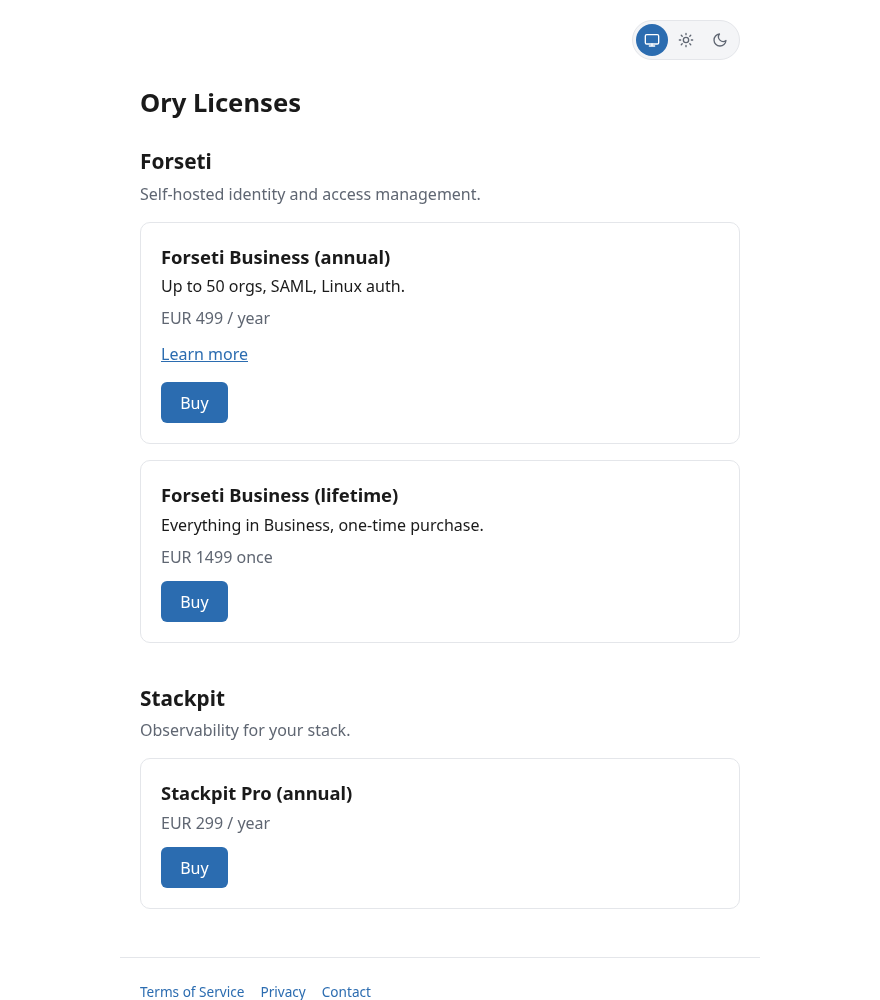
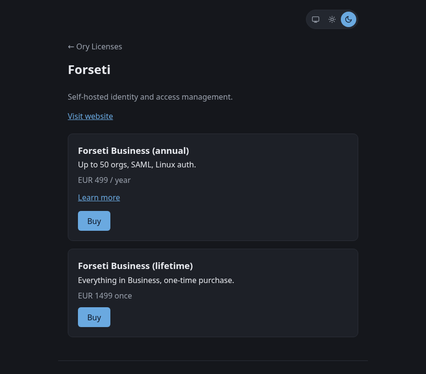

  

  # Signet

  **Sell software licenses without a licensing service.** Sign offline-verifiable license keys with Ed25519, and run a single-binary web shop that sells them through Stripe Checkout. Your apps ship only the public key and verify locally; nothing phones home.

  
  
  
  

I wrote Signet to sell licenses for my own self-hosted apps, then realized the machinery is generic: it doesn't know or care what your product is. A license is a small signed blob carrying who bought it, which product line, which features, and when it expires. The app that consumes it needs a few lines to verify a signature. That's the whole idea, and it turns out that's most of what a small software business needs.

There's no license server to run, no runtime dependency, no per-check network call. You keep a signing key offline, your app bakes in the matching public key, and verification is a local Ed25519 check. If you want to sell the licenses too, the shop is a single binary you point at Stripe.

  
  

## What's in the box

A Cargo workspace with three crates:

| Crate | What it is |
| --- | --- |
| `signetlib` | The shared library: license claims, Ed25519 signing, and the wire format. Depend on it (or copy `verify.rs`) to check licenses in your own app. |
| `signet-issuer` | An offline CLI: generate per-product keypairs, issue license blobs, verify/inspect them. Runs on an air-gapped box if you like. |
| `signet-shop` | A single-binary web shop: a storefront, Stripe Checkout, and idempotent license fulfillment, all configured from files. |

Two words for one thing: `signetlib` and the CLI call a product line a **product**; the shop's catalog calls it a **category**. A category id selects the signing key and is stamped into the license as its `product` claim. So a purchase in one product line only ever verifies against that line's public key, never another's.

## signet-issuer (CLI)

### Onboarding a product

    signet-issuer keygen --product acme
    # copy keys/acme/public.bin into your app (e.g. src/commercial/pubkey.bin), rebuild

The public half is what you ship in the app; the private half signs licenses and never leaves your keychain.

### Issuing a license

    signet-issuer issue \
      --product acme \
      --customer "Acme GmbH" \
      --email admin@acme.example \
      --tier business \
      --expires 2027-07-05 \
      --feature orgs --max-orgs 50 \
      --feature saml

Prints the base64 blob to stdout (paste it into your app's license screen) and appends a row to `ledger/<product>.jsonl`. Omit `--expires` for a lifetime license. Repeat `--feature` once per gated feature your app recognizes; `--feature` names and the optional numeric caps are yours to define.

### Verifying / inspecting a blob

    echo "<blob>" | signet-issuer verify --product acme -

### Keys and ledger layout

    keys/acme/{private,public}.bin      ledger/acme.jsonl
    keys/globex/{private,public}.bin    ledger/globex.jsonl

Back up `keys/` offline. Rotating a product's key invalidates every license already issued for that product (there's no overlap window), so plan to re-issue if you rotate.

## signet-shop (web app)

A single binary that serves a storefront, sends buyers to Stripe Checkout, and issues plus tracks licenses. It reuses `signetlib` for signing, so a license bought from the shop is byte-for-byte the same shape as a CLI-issued one.

### Configuration

Everything site-specific lives in files, not the binary, so one build runs any shop:

- `catalog.toml` (per-site, git-ignored; path via `CATALOG_PATH`, default `./catalog.toml`) - shop title, `[[category]]` product lines, `[[sku]]` purchasable plans, `[[page]]`/`[[footer_link]]` footer entries, and optional `[analytics]`. Start from `catalog.example.toml`.
- `content/<slug>.md` (per-site, git-ignored; path via `CONTENT_DIR`, default `./content`) - markdown for Terms, Privacy, and the like, served at `/p/<slug>` and read per request so edits need no restart. Starters in `content.example/`.
- `keys/<category>/private.bin` - the signing key for each category, as above.

Environment for `serve`: `STRIPE_API_KEY`, `STRIPE_WEBHOOK_SECRET`, `DATABASE_URL` (SQLite), `BASE_URL`, and optional `KEYS_DIR`, `CONTENT_DIR`, `CATALOG_PATH`, `BIND_ADDR` (default `127.0.0.1:8080`).

Email on purchase (optional, off by default): configure a provider to email the buyer their license and notify the operator of each sale. Settings live in an `[email]` table in `catalog.toml` (built on [polymail](https://github.com/franzos/polymail-rs)'s `ProviderConfig`); every field is overridable by `SIGNET_EMAIL__<FIELD>` env vars, and env always wins, so keep secrets blank in the file and inject them at runtime. Set `from_address` (and optional `from_name`), `operator_address` (optional `operator_name`) for the sale notice, and one `provider`: `lettermint` with `token`, or `smtp` with `host`/`port`/`tls` (`none`|`start_tls`|`implicit`)/`user`/`pass`. Both providers are compiled in; pick one per instance. Omit the section (and set no `SIGNET_EMAIL__PROVIDER`) or set `enabled = false` to disable. See `catalog.example.toml` for the full shape.

### Provisioning Stripe

Define categories and SKUs in `catalog.toml`, then:

    STRIPE_API_KEY=sk_... signet-shop provision-stripe

It creates (or reuses) a Stripe Product + Price per SKU and writes each resolved `stripe_price_id` back into `catalog.toml` (comments preserved). It's idempotent; changing a SKU's `amount_cents` supersedes the price (archiving the old one) and rewrites the id on the next run.

### Running

    signet-shop serve

The buy flow: a Buy button POSTs to `/checkout`, which redirects to Stripe's hosted Checkout. Stripe collects the buyer's email and a required "Company name" custom field, both embedded in the issued license. After payment the buyer lands on `/success`, which queries Stripe directly and mints the license, so it works even without a webhook; a `/success/download` link serves the license as a file. The `/webhook` endpoint (verified with `STRIPE_WEBHOOK_SECRET`) is the fallback that fulfills when the buyer never returns, or for delayed payment methods. Fulfillment is idempotent, keyed on the Stripe session id, so a license mints exactly once. Issued licenses are recorded in SQLite for tracking and reissue. When email is configured, the buyer is emailed their license (with expiry) and the operator gets a sale notice, sent once on the fresh mint and off the request path; a mail failure is logged and never blocks or reverses license delivery.

The UI is self-hosted (strict CSP), with a system/light/dark theme toggle and a configurable footer (content pages, links, and a payment-data notice). A configured `[analytics]` host is added to the CSP automatically.

### Docker

A prebuilt image is published to the GitHub Container Registry on every tag:

    docker run --rm -p 8080:8080 \
      -e STRIPE_API_KEY=sk_... \
      -e STRIPE_WEBHOOK_SECRET=whsec_... \
      -e BASE_URL=https://shop.example \
      -e DATABASE_URL=sqlite:///data/signet.db \
      -v "$PWD/catalog.toml:/app/catalog.toml:ro" \
      -v "$PWD/content:/app/content:ro" \
      -v "$PWD/keys:/app/keys:ro" \
      -v signet-data:/data \
      ghcr.io/franzos/signet serve

## Verifying a license in your app

Your app needs the public key and a signature check. Add the library with `cargo add signetlib`; its `codec::decode_and_verify` does it in one call, and the claims are a plain struct you match on. The gist:

    let claims = signetlib::codec::decode_and_verify(&blob, &public_key)?;
    if claims.expired(now) { /* grace / lock */ }
    for feature in &claims.features { /* unlock */ }

Unknown feature strings and unknown claim fields are ignored on decode, so a newer issuer can add features an older binary hasn't learned yet without breaking verification. The `product` claim is defense-in-depth: the per-product signing key is the real gate, so a blob signed for one product simply won't verify against another's public key.

## Wire format

Each blob is `base64(OPLB || v1 || cbor(SignedBlob))`, where `SignedBlob` carries the canonical CBOR-encoded claims plus an Ed25519 signature over those exact claim bytes. The `OPLB` magic and version byte let a verifier reject obvious garbage before spending CBOR-decode work, and keep future format changes detectable. The signature is checked against the observed claim bytes (not a re-serialized copy), so CBOR map-ordering differences across implementations can't break verification.

## Building

Rust stable, standard Cargo:

    cargo build --release            # both binaries
    cargo test --workspace

The shop links a bundled SQLite (needs a C toolchain) and talks to Stripe over rustls (no OpenSSL, no libpq).

## License

MIT. See [LICENSE](LICENSE). Copyright (c) 2026 Franz Geffke.
